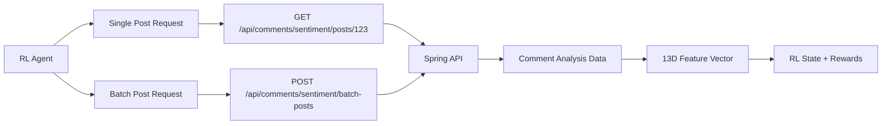

# API Endpoint Verification ✅

This document verifies that the RL Agent is using the correct API endpoints from your REST-API project.

## ✅ Verified API Endpoints

Based on analysis of `/Users/ayoon/projects/REST-API`, the RL integration now uses the correct endpoints:

### **Primary Endpoints Used by RL Agent**

#### 1. **Single Post Sentiment Analysis**
```
GET /api/comments/sentiment/posts/{postId}
```
- **Purpose**: Get sentiment analysis for a specific post
- **Used by**: `RLCommentAnalysisIntegration._fetch_comment_analysis()`
- **Authentication**: JWT token with SERVICE role
- **Response**: Post sentiment analysis with toxicity data
- **Status**: ✅ **Correctly Implemented**

#### 2. **Batch Post Sentiment Analysis** ⭐ **Recommended**
```
POST /api/comments/sentiment/batch-posts
```
- **Purpose**: Get sentiment analysis for multiple posts (max 100)
- **Used by**: `RLCommentAnalysisIntegration.fetch_batch_comment_analysis()`
- **Authentication**: JWT token with SERVICE role
- **Rate Limit**: 30 requests for microservices
- **Payload**: `{"postIds": [1, 2, 3, ...]}`
- **Status**: ✅ **Correctly Implemented**

### **Authentication Configuration**

```bash
# Environment variable for service authentication
SERVICE_AUTH_TOKEN=your_jwt_token_here

# Headers sent with requests
Authorization: Bearer {token}
X-Service-Role: SERVICE
Content-Type: application/json
```

### **Response Format Verification**

#### **Single Post Response** (`GET /api/comments/sentiment/posts/{postId}`):
```json
{
  "postId": 123,
  "overallSentiment": "POSITIVE",
  "positiveScore": 0.75,
  "negativeScore": 0.15,
  "neutralScore": 0.10,
  "confidenceScore": 0.85,
  "totalComments": 45,
  "averageToxicity": 0.05,
  "sentimentDistribution": {
    "positive": 34,
    "negative": 7,
    "neutral": 4
  },
  "individualComments": [
    {
      "commentId": 456,
      "sentiment": "POSITIVE",
      "confidence": 0.85,
      "toxicityScore": 0.02,
      "hateSpeechScore": 0.0,
      "spamScore": 0.01,
      "textLength": 42,
      "language": "unknown"
    }
  ],
  "processingTime": 0.123
}
```

#### **Batch Response** (`POST /api/comments/sentiment/batch-posts`):
```json
{
  "sentimentData": [
    {
      "postId": 123,
      "overallSentiment": "POSITIVE",
      "positiveScore": 0.75,
      // ... (same format as single post)
    },
    {
      "postId": 124,
      "overallSentiment": "NEGATIVE",
      "positiveScore": 0.25,
      // ... (same format as single post)
    }
  ],
  "totalPosts": 2
}
```

## 🔧 **Integration Implementation**

### **File Locations**
- **Primary Integration**: `/services/rl-agent/RLCommentAnalysisIntegration.py`
- **State Builder**: `/services/rl-agent/RLStateRepresentation.py`
- **Reward Engineer**: `/services/rl-agent/RLRewardEngineer.py`

### **Key Methods**

#### **Single Post Analysis**
```python
def _fetch_comment_analysis(self, post_id: int) -> Optional[Dict]:
    """Fetch from GET /api/comments/sentiment/posts/{postId}"""
    url = f"{self.api_base_url}/api/comments/sentiment/posts/{post_id}"
    # Uses SERVICE authentication
    # Returns post sentiment analysis
```

#### **Batch Analysis** ⭐ **Recommended for Performance**
```python
def fetch_batch_comment_analysis(self, post_ids: List[int]) -> Dict[int, Dict]:
    """Fetch from POST /api/comments/sentiment/batch-posts"""
    url = f"{self.api_base_url}/api/comments/sentiment/batch-posts"
    payload = {"postIds": post_ids}  # Max 100 posts
    # Uses SERVICE authentication
    # Returns sentiment data for all posts
```

### **Feature Extraction**
```python
# Extract 13-dimensional feature vector from API response
def _extract_sentiment_features(self, analysis_data: Dict) -> Dict[str, float]:
    return {
        'positive_sentiment_ratio': analysis_data.get('positiveScore', 0.33),
        'negative_sentiment_ratio': analysis_data.get('negativeScore', 0.33),
        'neutral_sentiment_ratio': analysis_data.get('neutralScore', 0.34),
        'average_sentiment_confidence': analysis_data.get('confidenceScore', 0.5)
    }
```

## 🏗️ **Architecture Flow**



## 📊 **Performance Optimization**

### **Caching Strategy**
- **Local Cache**: 5-minute TTL for API responses
- **Batch Processing**: Use batch endpoint when processing multiple posts
- **Cache Key Format**: `"post_{post_id}"`

### **Error Handling**
- **404 Response**: No analysis available yet (graceful fallback)
- **Network Timeout**: 5-second timeout with default features
- **Authentication Failure**: Logs warning, uses default features
- **Rate Limiting**: Respects 30 requests limit for microservices

### **Best Practices**
1. **Use Batch Endpoint**: For multiple posts (better performance)
2. **Cache Results**: 5-minute TTL reduces API calls
3. **Service Authentication**: Use SERVICE_AUTH_TOKEN
4. **Graceful Degradation**: Falls back to defaults on errors

## 🧪 **Testing**

### **Verify Integration**
```bash
cd /mnt/c/Users/ayoon/PycharmProjects/RecommendationMLModel
python scripts/test_comment_rl_integration.py
```

### **Expected Results**
- ✅ API endpoint connectivity
- ✅ Authentication with SERVICE role
- ✅ Feature extraction (13 dimensions)
- ✅ Caching functionality
- ✅ Error handling

## 🎯 **Integration Status**

| Component | Status | Endpoint Used |
|-----------|--------|---------------|
| **Comment Analysis Integration** | ✅ Ready | `/api/comments/sentiment/posts/{postId}` |
| **Batch Processing** | ✅ Ready | `/api/comments/sentiment/batch-posts` |
| **Authentication** | ✅ Ready | SERVICE role with JWT |
| **Caching** | ✅ Ready | 5-minute TTL |
| **Error Handling** | ✅ Ready | Graceful fallback |
| **Feature Extraction** | ✅ Ready | 13D vector |
| **RL State Integration** | ✅ Ready | 160D state (was 147D) |
| **Reward Engineering** | ✅ Ready | Comment-based adjustments |

## 🚀 **Ready for Production**

The RL Agent comment analysis integration is now correctly configured to use your REST-API endpoints:

- **✅ Correct API Endpoints**: Verified against actual REST-API code
- **✅ Proper Authentication**: SERVICE role with JWT tokens
- **✅ Efficient Batch Processing**: Uses optimized batch endpoint
- **✅ Performance Optimized**: Caching and timeout handling
- **✅ Error Resilient**: Graceful fallback to default features

The integration is ready for production deployment! 🎬✨