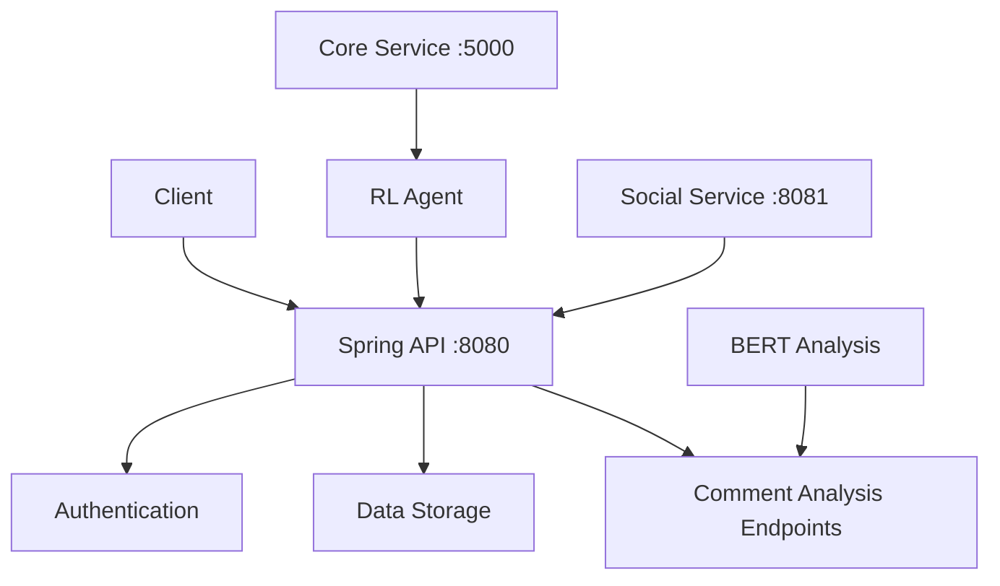
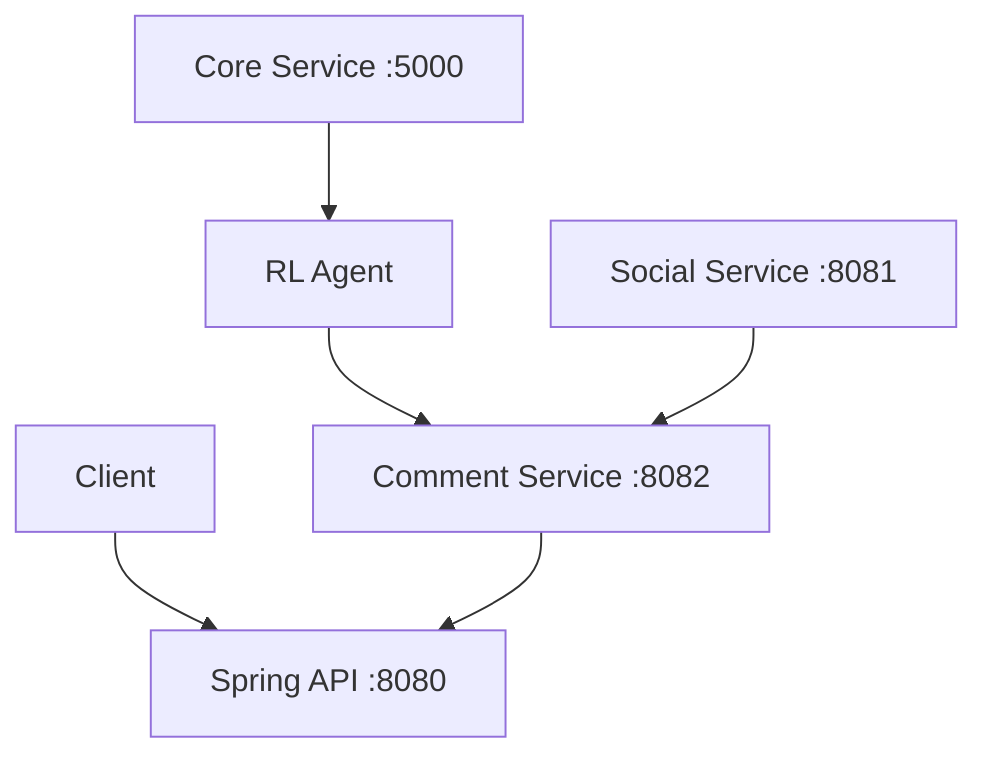

# Comment Analysis + Spring API Integration ⚡

Yes! The comment analysis service and Spring API can absolutely run on the same port. Here are the integration options:

## 🎯 **Integration Options**

### **Option 1: Integrated Mode (Recommended)** ⭐
- **Spring API** runs on port 8080 with built-in comment analysis endpoints
- **Comment Analysis Service** is **NOT started separately**
- **RL Agent** fetches comment data directly from Spring API endpoints

### **Option 2: Standalone Mode**
- **Spring API** runs on port 8080 for data storage
- **Comment Analysis Service** runs on separate port (8082)
- **Comment Service** updates Spring API via API calls

### **Option 3: Hybrid Mode**
- **Spring API** runs on port 8080
- **Comment Analysis Service** runs on port 8080 (same port, different paths)
- Both services handle different endpoint patterns

## ⚙️ **How Integration Works**

### **Integrated Mode Configuration**

#### **1. Spring API Endpoints** (Port 8080)
```
# Spring API handles these endpoints:
GET  /api/comments/sentiment/posts/{postId}      # ✅ Used by RL Agent
POST /api/comments/sentiment/batch-posts         # ✅ Used by RL Agent
GET  /actuator/health                            # Health check

# Spring API also provides:
POST /api/comments/insert                        # Creates comments
GET  /api/posts/{postId}/comments               # Retrieves comments
PUT  /api/comments/{commentId}/analysis          # Updates analysis
```

#### **2. RL Agent Configuration**
```bash
# Environment variables for integrated mode
SPRING_API_URL=http://localhost:8080
COMMENT_SERVICE_URL=http://localhost:8080  # Same as Spring API
SERVICE_AUTH_TOKEN=your_jwt_token_here
```

#### **3. Service Detection Logic**
The startup script automatically detects the configuration:

```bash
# Auto-detection in start_microservices.sh
if curl -s -f "http://localhost:8080/actuator/health" > /dev/null 2>&1; then
    echo "✓ Spring API detected - RL will use integrated endpoints"
    export COMMENT_SERVICE_INTEGRATED=true
else
    echo "Starting standalone Comment Analysis Service"
    # Start separate comment service
fi
```

## 🚀 **Recommended Setup: Integrated Mode**

### **Step 1: Start Spring API** (Port 8080)
```bash
cd /Users/ayoon/projects/REST-API
./gradlew bootRun  # Starts on port 8080 with comment endpoints
```

### **Step 2: Start ML Services**
```bash
cd /mnt/c/Users/ayoon/PycharmProjects/RecommendationMLModel/scripts
./start_microservices.sh  # Auto-detects Spring API integration
```

**What happens:**
1. ✅ Script detects Spring API on port 8080
2. ✅ Skips starting separate comment service
3. ✅ Configures RL Agent to use Spring API endpoints
4. ✅ Starts Social Service (port 8081) and Core Service (port 5000)

### **Step 3: Verify Integration**
```bash
# Test Spring API comment endpoints
curl "http://localhost:8080/api/comments/sentiment/posts/123"

# Test RL Agent using Spring API data
curl -X POST http://localhost:5000/recommendations \
  -H "Content-Type: application/json" \
  -d '{"userId": "123", "limit": 10}'

# Verify RL stats include comment analysis
curl http://localhost:5000/stats
```

## 📊 **Architecture Comparison**

### **Integrated Mode** ⭐ **Recommended**


**Benefits:**
- ✅ **Single Port**: Everything on 8080
- ✅ **Simplified Deployment**: One less service to manage
- ✅ **Better Performance**: No network overhead between services
- ✅ **Unified Authentication**: Single JWT token
- ✅ **Consistent Data**: Single source of truth

### **Standalone Mode**


**When to Use:**
- Development/testing with different comment service versions
- Need to scale comment analysis independently
- Different deployment environments

## 🛠️ **Configuration Files**

### **Environment Variables** (`.env`)
```bash
# Integrated Mode (Recommended)
SPRING_API_URL=http://localhost:8080
COMMENT_SERVICE_URL=http://localhost:8080  # Same as Spring API
SERVICE_AUTH_TOKEN=your_jwt_token_here

# OR Standalone Mode
SPRING_API_URL=http://localhost:8080
COMMENT_SERVICE_URL=http://localhost:8082  # Separate port
```

### **RL Agent Configuration**
The RL Agent automatically uses the correct endpoints:

```python
# In RLCommentAnalysisIntegration.py
def _fetch_comment_analysis(self, post_id: int):
    # Uses Spring API endpoint (integrated mode)
    url = f"{self.api_base_url}/api/comments/sentiment/posts/{post_id}"
    
def fetch_batch_comment_analysis(self, post_ids: List[int]):
    # Uses Spring API batch endpoint (integrated mode) 
    url = f"{self.api_base_url}/api/comments/sentiment/batch-posts"
```

## 🎯 **Production Recommendations**

### **For Production: Use Integrated Mode**
```yaml
# docker-compose.yml example
version: '3.8'
services:
  spring-api:
    image: your-spring-api:latest
    ports:
      - "8080:8080"
    environment:
      - COMMENT_ANALYSIS_ENABLED=true
      
  core-recommendations:
    image: your-core-service:latest
    ports:
      - "5000:5000"
    environment:
      - SPRING_API_URL=http://spring-api:8080
      - COMMENT_SERVICE_URL=http://spring-api:8080  # Same service
      
  social-recommendations:
    image: your-social-service:latest
    ports:
      - "8081:8081"
    environment:
      - SPRING_API_URL=http://spring-api:8080
```

### **Benefits of Integrated Mode:**
1. **🚀 Performance**: No inter-service network calls
2. **🔒 Security**: Single authentication point
3. **📊 Monitoring**: Unified logging and metrics
4. **🛠️ Deployment**: Fewer moving parts
5. **💰 Cost**: Reduced infrastructure overhead

## ✅ **Summary**

**Yes, comment analysis and Spring API can run on the same port!**

**Recommended Setup:**
1. **Spring API** on port 8080 with comment analysis endpoints
2. **Core Recommendations** on port 5000 with RL Agent
3. **Social Recommendations** on port 8081
4. **RL Agent** fetches comment data from Spring API (port 8080)

**Configuration:**
```bash
SPRING_API_URL=http://localhost:8080
COMMENT_SERVICE_URL=http://localhost:8080  # Same port! ✅
```

This gives you a **cleaner, faster, and more maintainable** architecture! 🎬✨