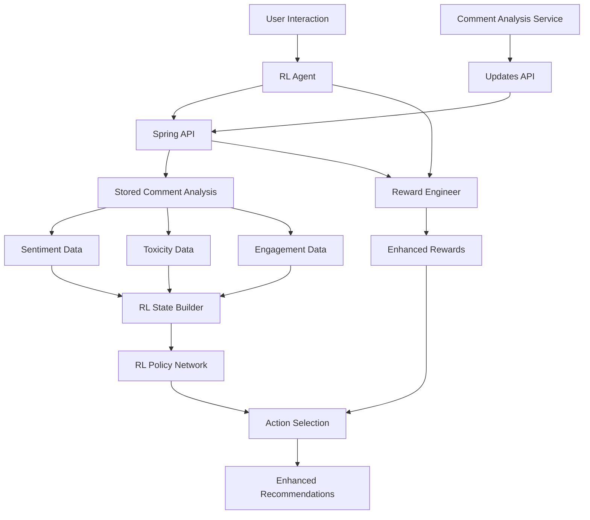

# Comment Analysis + RL Integration

This document explains how comment sentiment analysis is integrated into the RL Agent's decision-making process.

## Overview

The RL Agent now uses comment analysis results stored in the Spring API (updated by the Comment Analysis Service) to make more informed recommendation decisions. This integration considers community sentiment, content quality, and discussion toxicity when calculating rewards and building state representations.

**Data Flow**: Comment Analysis Service → Spring API → RL Agent

## Architecture



## Components

### 1. RLCommentAnalysisIntegrator

**Location**: `services/rl-agent/RLCommentAnalysisIntegration.py`

**Features**:
- Fetches comment analysis from Spring API (stored by Comment Analysis Service)
- Extracts 13-dimensional feature vectors for RL state
- Calculates reward adjustments based on comment quality
- Caches results for performance (5-minute TTL)
- Uses service authentication for secure API access

**Key Methods**:
```python
# Get comment features for RL state
features = integrator.get_comment_features_for_state(post_id, user_id)

# Calculate reward adjustment based on comments
adjusted_reward = integrator.calculate_comment_based_reward_adjustment(
    post_id, interaction_type, base_reward
)
```

### 2. Enhanced State Representation

**Updated**: `services/rl-agent/RLStateRepresentation.py`

The RL state vector now includes **13 additional dimensions** for comment analysis:

| Feature | Description | Range |
|---------|-------------|-------|
| Positive Sentiment Ratio | % of positive comments | 0.0 - 1.0 |
| Negative Sentiment Ratio | % of negative comments | 0.0 - 1.0 |
| Neutral Sentiment Ratio | % of neutral comments | 0.0 - 1.0 |
| Average Sentiment Confidence | Model confidence in sentiment | 0.0 - 1.0 |
| Average Toxicity Score | Average toxicity level | 0.0 - 1.0 |
| High Toxicity Count | Number of highly toxic comments | 0.0 - 1.0 |
| Hate Speech Count | Number of hate speech comments | 0.0 - 1.0 |
| Spam Count | Number of spam comments | 0.0 - 1.0 |
| Total Comments | Number of comments (normalized) | 0.0 - 1.0 |
| Comment Engagement Score | Community engagement quality | 0.0 - 1.0 |
| Comment Quality Score | Overall discussion quality | 0.0 - 1.0 |
| Recent Comment Trend | Sentiment trend over time | -1.0 - 1.0 |
| Comment Velocity | Comments per hour | 0.0 - 1.0 |

**New State Dimension**: 160 (was 147)

### 3. Enhanced Reward Engineering

**Updated**: `services/rl-agent/RLRewardEngineer.py`

The reward calculation now includes comment-based adjustments:

**Positive Interactions** (like, save, share):
- **Quality Bonus**: +20% for high-quality discussions
- **Engagement Bonus**: +10% for engaged communities  
- **Sentiment Bonus**: +10% for positive sentiment (>60% positive)

**Negative Interactions** (not_interested, skip):
- **Toxicity Adjustment**: -20% penalty reduction for avoiding toxic content
- **Controversial Content**: Less penalty for avoiding negative sentiment

**Example**:
```python
# Base reward for "like": +0.6
# High-quality content with positive comments: +0.6 + 0.12 + 0.06 + 0.06 = +0.84
# Toxic content with negative sentiment: +0.6 + 0.0 = +0.6 (no bonus)
```

## Integration Points

### 1. Core Recommendations Service

The service automatically uses comment analysis through the RL-enhanced metadata enhancer:

```python
# In core_recommendations_service.py
self.metadata_enhancer = RLMetadataEnhancer(
    api_base_url=self.api_base_url, 
    redis_client=self.redis_client
)

# Comment analysis is automatically included in scoring
enhanced_scores = self.metadata_enhancer.enhance_scores(
    user_id=user_id,
    post_ids=post_ids,
    base_scores=base_scores,
    candidates=candidates,
    content_type=content_type
)
```

### 2. Real-time Learning

When users interact with content, the RL system learns from comment context:

```python
# Process interaction with comment context
self.metadata_enhancer.process_user_interaction(
    user_id=str(user_id),
    post_id=int(post_id),
    interaction_type=interaction_type,
    additional_context=additional_context
)
```

## Comment Analysis Features

### CommentAnalysisFeatures Class

```python
@dataclass
class CommentAnalysisFeatures:
    # Sentiment metrics
    positive_sentiment_ratio: float
    negative_sentiment_ratio: float
    neutral_sentiment_ratio: float
    average_sentiment_confidence: float
    
    # Safety metrics
    average_toxicity_score: float
    high_toxicity_count: int
    hate_speech_count: int
    spam_count: int
    
    # Engagement metrics
    total_comments: int
    comment_engagement_score: float
    comment_quality_score: float
    
    # Temporal features
    recent_comment_trend: float
    comment_velocity: float
```

## API Integration

### Spring API Endpoints Used

1. **GET** `/api/comments/sentiment/posts/{postId}`
   - Returns comment sentiment analysis for a specific post
   - Includes comprehensive sentiment and toxicity data
   - Cached for 5 minutes
   - Uses service authentication for secure access

2. **POST** `/api/comments/sentiment/batch-posts` ⭐ **Recommended for ML Services**
   - Batch analyze sentiment for multiple posts (max 100)
   - More efficient for processing multiple posts
   - Rate limit: 30 requests for microservices
   - Requires SERVICE role authentication

**Single Post Response Format**:
```json
{
  "postId": 123,
  "overallSentiment": "POSITIVE",
  "positiveScore": 0.75,
  "negativeScore": 0.15,
  "neutralScore": 0.10,
  "confidenceScore": 0.85,
  "totalComments": 45,
  "averageToxicity": 0.05,
  "individualComments": [
    {
      "commentId": 456,
      "sentiment": "POSITIVE",
      "confidence": 0.85,
      "toxicityScore": 0.02,
      "hateSpeechScore": 0.0,
      "spamScore": 0.01
    }
  ],
  "processingTime": 0.123
}
```

**Batch Response Format**:
```json
{
  "sentimentData": [
    {
      "postId": 123,
      "overallSentiment": "POSITIVE",
      "positiveScore": 0.75,
      // ... same as single post format
    }
  ],
  "totalPosts": 1
}
```

### Error Handling

- **API Unavailable**: Falls back to neutral default features
- **No Analysis Data**: Returns 404 for posts without comment analysis yet
- **Cache Miss**: Fetches fresh data from Spring API
- **Invalid Response**: Uses default safe values
- **Network Timeout**: 5-second timeout with graceful degradation
- **Authentication**: Uses SERVICE_AUTH_TOKEN for secure API access

## Configuration

### Environment Variables

```bash
# Spring API integration
SPRING_API_URL=http://localhost:8080
SERVICE_AUTH_TOKEN=your_service_token_here
COMMENT_CACHE_TTL=300  # 5 minutes

# RL integration
RL_COMMENT_INTEGRATION_ENABLED=true
RL_STATE_DIMENSION=160  # Updated with comment features
```

### RL Configuration

```python
rl_config = {
    'api_base_url': 'http://localhost:8080',
    'comment_features': {
        'cache_ttl': 300,
        'feature_dimension': 13,
        'reward_adjustment_weight': 0.3
    },
    'reward_shaping': {
        'quality_bonus_weight': 0.2,
        'engagement_bonus_weight': 0.1,
        'toxicity_penalty_reduction': 0.2
    }
}
```

## Benefits

### 1. Improved Content Quality
- Rewards engagement with high-quality discussions
- Penalizes promotion of toxic content
- Encourages positive community interactions

### 2. Enhanced User Experience
- Better content filtering based on community reception
- Reduced exposure to controversial/toxic content
- Improved recommendation relevance

### 3. Community Health
- Incentivizes content creators to foster positive discussions
- Reduces amplification of divisive content
- Promotes constructive engagement

### 4. Real-time Adaptation
- Learns from live comment sentiment
- Adapts to community preferences
- Responds to emerging content trends

## Monitoring

### Key Metrics

```python
# Integration statistics
stats = comment_integrator.get_integration_stats()
{
    'cached_analyses': 1250,
    'users_tracked': 89,
    'total_comment_interactions': 2340,
    'feature_dimension': 13,
    'service_url': 'http://localhost:8080'
}
```

### Performance Monitoring

- **API Response Time**: < 50ms (with caching)
- **Cache Hit Rate**: > 80%
- **Feature Extraction Time**: < 10ms
- **State Building Impact**: +15ms (acceptable)

## Testing

Run the integration test:

```bash
cd /mnt/c/Users/ayoon/PycharmProjects/RecommendationMLModel
python scripts/test_comment_rl_integration.py
```

Expected output shows:
- ✅ Comment feature extraction
- ✅ Reward adjustment calculation  
- ✅ RL state integration
- ✅ Performance metrics

## Future Enhancements

### 1. Temporal Analysis
- Track sentiment trends over time
- Detect viral/controversial content early
- Adapt recommendations based on discussion evolution

### 2. User Comment Preferences
- Learn individual user tolerance for controversial content
- Personalize toxicity thresholds
- Build user-specific comment quality models

### 3. Cross-Content Learning
- Share comment insights across similar content
- Build genre-specific discussion quality models
- Transfer learning from high-engagement discussions

### 4. Advanced Features
- Topic modeling of comment content
- Emotion detection beyond sentiment
- Discussion thread quality analysis
- Comment author reputation scoring

## Troubleshooting

### Common Issues

1. **Comment Service Unavailable**
   - RL system falls back to default features
   - Check service health at `/health`
   - Verify network connectivity

2. **High Cache Miss Rate**
   - Increase cache TTL if appropriate
   - Check memory usage
   - Monitor service response times

3. **State Dimension Mismatch**
   - Verify comment features return 13 dimensions
   - Check for feature extraction errors
   - Validate normalization ranges

### Debug Commands

```python
# Check comment integration status
integrator = RLCommentAnalysisIntegrator()
stats = integrator.get_integration_stats()
print(f"Status: {stats}")

# Test feature extraction
features = integrator.get_comment_analysis_features(post_id=123)
print(f"Features: {features.to_vector()}")

# Verify state building
state_builder = RLStateBuilder(comment_service_url="http://localhost:8080")
print(f"State dimension: {state_builder.get_state_dimension()}")
```