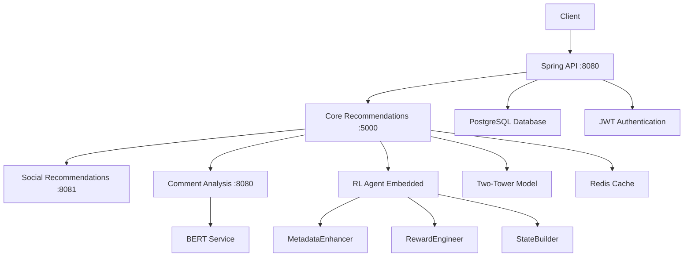
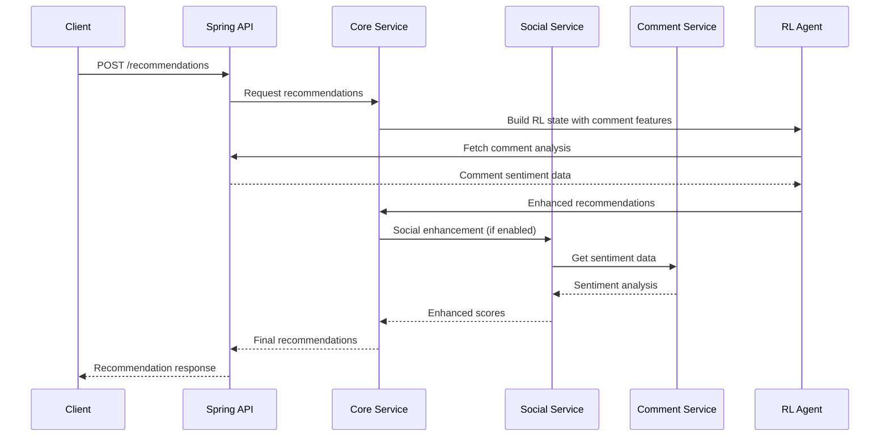
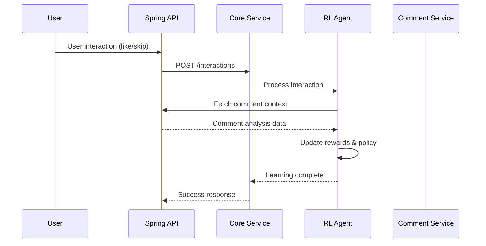

# Service Deployment Guide 🚀

This guide explains how to run the recommendation system microservices and the complete system architecture.

## 🏗️ System Architecture



## 🎯 Service Overview

| Service | Port | Purpose | Dependencies |
|---------|------|---------|--------------|
| **Spring API** | 8080 | Main backend API, data storage | PostgreSQL, JWT |
| **Core Recommendations** | 5000 | ML recommendations with RL | Redis, Two-Tower Model |
| **Social Recommendations** | 8081 | Social-aware recommendations | Core Service, Comment Service |
| **Comment Analysis** | 8080 | BERT sentiment analysis | BERT Service |

## 📋 Prerequisites

### 1. **System Requirements**
```bash
# Python 3.8+
python --version

# Redis Server
redis-server --version

# PostgreSQL (for Spring API)
psql --version

# Java 17+ (for Spring API)
java --version
```

### 2. **Install Dependencies**
```bash
cd /mnt/c/Users/ayoon/PycharmProjects/RecommendationMLModel

# Install Python dependencies for each service
pip install -r services/core-recommendations/requirements.txt
pip install -r services/social-recommendations/requirements.txt  
pip install -r services/comment-analysis/requirements.txt

# Install shared components
pip install -r bert_requirements.txt
```

## 🚀 Starting the Services

### **Option 1: Start All Services (Recommended)**

```bash
cd /mnt/c/Users/ayoon/PycharmProjects/RecommendationMLModel/scripts

# Make scripts executable
chmod +x start_microservices.sh stop_microservices.sh

# Start all services
./start_microservices.sh
```

**What this script does:**
1. ✅ Checks if Redis is running
2. ✅ Starts Comment Analysis Service (port 8080)
3. ✅ Starts Social Recommendations Service (port 8081)
4. ✅ Starts Core Recommendations Service (port 5000)
5. ✅ Waits for each service to be ready
6. ✅ Provides health check URLs

### **Option 2: Start Services Individually**

#### **1. Start Redis** (Required first)
```bash
# macOS
brew services start redis

# Linux
sudo systemctl start redis

# Docker
docker run -d -p 6379:6379 redis:7-alpine

# Verify Redis is running
redis-cli ping  # Should return "PONG"
```

#### **2. Start Spring API** (External - from REST-API project)
```bash
cd /Users/ayoon/projects/REST-API
./gradlew bootRun  # Starts on port 8080
```

#### **3. Start Comment Analysis Service**
```bash
cd /mnt/c/Users/ayoon/PycharmProjects/RecommendationMLModel/services/comment-analysis
python comment_analysis_service.py
```

#### **4. Start Social Recommendations Service**
```bash
cd /mnt/c/Users/ayoon/PycharmProjects/RecommendationMLModel/services/social-recommendations
python social_recommendations_service.py
```

#### **5. Start Core Recommendations Service**
```bash
cd /mnt/c/Users/ayoon/PycharmProjects/RecommendationMLModel/services/core-recommendations
python core_recommendations_service.py
```

## ⚙️ Configuration

### **Environment Variables**

Copy and configure the environment file:
```bash
cp .env.microservices .env
```

**Key Configuration Options:**

```bash
# Service Ports
CORE_SERVICE_PORT=5000
SOCIAL_SERVICE_PORT=8081
COMMENT_SERVICE_PORT=8080

# API Integration
SPRING_API_URL=http://localhost:8080
SERVICE_AUTH_TOKEN=service_token_placeholder_for_microservices

# Redis Configuration
REDIS_HOST=localhost
REDIS_PORT=6379
LOCAL_DEV=true

# ML Model Configuration
USER_FEATURE_DIM=64
POST_FEATURE_DIM=64
EMBEDDING_DIM=32
MODEL_DIR=./model_checkpoints

# RL Configuration (NEW)
RL_COMMENT_INTEGRATION_ENABLED=true
RL_STATE_DIMENSION=160  # Updated with comment features
```

### **Service-Specific Configuration**

#### **Core Recommendations Service (Port 5000)**
- **RL Integration**: ✅ Enabled with comment analysis
- **Two-Tower Model**: ML recommendation engine
- **Redis Caching**: User/post vectors and metadata
- **API Integration**: Fetches data from Spring API

#### **Social Recommendations Service (Port 8081)**
- **Social Features**: Following relationships, community trends
- **Comment Analysis**: Integrates sentiment for social scoring
- **Toxicity Filtering**: Filters content based on community feedback

#### **Comment Analysis Service (Port 8080)**
- **BERT Integration**: Multi-language sentiment analysis
- **API Updates**: Updates Spring API with analysis results
- **Caching**: 5-minute TTL for analysis results

## 🧪 Health Checks & Testing

### **Verify All Services**
```bash
# Core Recommendations
curl http://localhost:5000/health

# Social Recommendations  
curl http://localhost:8081/health

# Comment Analysis
curl http://localhost:8080/health

# Spring API (external)
curl http://localhost:8080/actuator/health
```

### **Test Recommendation Flow**
```bash
# Get recommendations for user
curl -X POST http://localhost:5000/recommendations \
  -H "Content-Type: application/json" \
  -d '{"userId": "123", "limit": 10, "enableSocial": true}'

# Process user interaction (RL learning)
curl -X POST http://localhost:5000/interactions \
  -H "Content-Type: application/json" \
  -d '{"userId": "123", "postId": 456, "interactionType": "like"}'

# Get RL statistics
curl http://localhost:5000/stats
```

### **Test Comment Analysis Integration**
```bash
# Analyze post sentiment
curl http://localhost:8080/comments/posts/123/sentiment

# Run integration test
cd /mnt/c/Users/ayoon/PycharmProjects/RecommendationMLModel
python scripts/test_comment_rl_integration.py
```

## 📊 Monitoring & Logs

### **Service Logs**
```bash
# View logs for all services
tail -f logs/core-recommendations.log
tail -f logs/social-recommendations.log  
tail -f logs/comment-analysis.log
```

### **Key Metrics to Monitor**
- **Response Times**: < 100ms for recommendations
- **Cache Hit Rates**: > 80% for optimal performance
- **RL Learning**: Comment analysis integration working
- **Error Rates**: < 1% for production readiness

### **Debug Common Issues**
```bash
# Check Redis connection
redis-cli ping

# Check port availability
lsof -i :5000  # Core service
lsof -i :8081  # Social service  
lsof -i :8080  # Comment/Spring API

# Check Python processes
ps aux | grep python | grep service
```

## 🛑 Stopping Services

### **Stop All Services**
```bash
cd /mnt/c/Users/ayoon/PycharmProjects/RecommendationMLModel/scripts
./stop_microservices.sh
```

### **Stop Individual Services**
```bash
# Find and kill specific service PIDs
pkill -f "core_recommendations_service.py"
pkill -f "social_recommendations_service.py"
pkill -f "comment_analysis_service.py"
```

## 🔄 Service Communication Flow

### **Recommendation Request Flow**


### **Learning Flow (User Interactions)**


## 🎯 Production Deployment

### **Environment Setup**
```bash
# Production environment variables
LOCAL_DEV=false
REDIS_SSL=true
REDIS_PASSWORD=your_redis_password
SERVICE_AUTH_TOKEN=your_production_jwt_token

# Scaling configuration
REDIS_TIMEOUT=5
CACHE_TTL=3600
SENTIMENT_CACHE_SIZE=10000
```

### **Container Deployment** (Docker)
```dockerfile
# Example Dockerfile for Core Service
FROM python:3.9-slim
WORKDIR /app
COPY requirements.txt .
RUN pip install -r requirements.txt
COPY . .
EXPOSE 5000
CMD ["python", "core_recommendations_service.py"]
```

### **Load Balancing Considerations**
- **Stateless Design**: All services are stateless except for Redis cache
- **Horizontal Scaling**: Multiple instances can run behind load balancer
- **Session Affinity**: Not required due to Redis-based caching

## 🎉 Ready for Production!

Your recommendation system with RL and comment analysis integration is now ready to run:

- ✅ **Complete Microservice Architecture**
- ✅ **RL-Enhanced Recommendations** with comment analysis
- ✅ **Social Integration** with community sentiment
- ✅ **Real-time Learning** from user interactions
- ✅ **Production-Ready** monitoring and deployment scripts

🚀 **Start the system**: `./scripts/start_microservices.sh`
🛑 **Stop the system**: `./scripts/stop_microservices.sh`

Happy recommending! 🎬✨